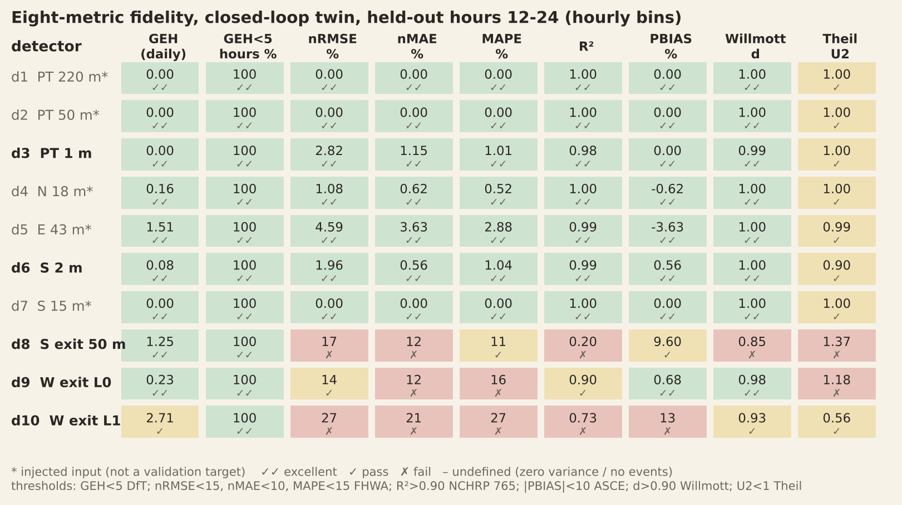

# Zürich intersection — SUMO detector + signal replay

Replays the Genser et al. (2023) 1-s dataset in SUMO: signals sg1–sg12 forced from the CSV
every simulated second, detectors d1–d10 as induction loops at the paper's positions, multi-day.

> Genser, Makridis, Yang, Abmühl, Menendez, Kouvelas (2023). *A traffic signal and loop detector dataset of an
> urban intersection regulated by a fully actuated signal control system.* Data in Brief 48, 109117.
> Data: ETH Research Collection, doi:10.3929/ethz-b-000556642 (CC BY 4.0).
> (The top-level README of this repo cites the wrong title/authors.)

## Run
```bash
pip install eclipse-sumo traci pandas numpy         # or a system SUMO >= 1.18
python replay/build_network.py                      # only needed if you edit the geometry
python replay/replay.py --csv data/feb04_only.csv --mode exact --out out
# multi-day: any mix of files / directories / globs; days are split automatically
python replay/replay.py --csv /path/to/intersection_data_set_*.csv --mode exact --out out
python replay/replay.py --csv data/ --from "2019-02-04 06:00" --to "2019-02-04 10:00" --gui   # watch it
# fully-actuated twin: calibrate the controller on 00-12 h, run the day, report the held-out half
python replay/calibrate_controller.py --csv data/feb04_only.csv --train-until "2019-02-04 12:00:00"
python replay/replay.py --csv data/feb04_only.csv --mode actuated --holdout-from "2019-02-04 12:00:00" --out out_act
python replay/plots.py --csv data/feb04_only.csv --runs exact=out_ex hybrid=out_hy actuated=out_act --holdout-from "2019-02-04 12:00:00"
```
Full day ≈ 5 min headless (≈ 86 400 TraCI steps). Outputs per day in `out/<date>/`:
`sim_detectors.csv` (same layout as the input; detector columns = what the SUMO loops saw, sg columns = field
signals, `sg_applied_ok` = TLS state read back from SUMO equals the commanded state) and `report.csv`
(events, occupancy, per-second accuracy, Jaccard, ±`--tol` s event precision/recall). `out/report_<mode>.csv` aggregates days.

## Clock
Sim time = seconds since 00:00 of the first day in the data; day *n* starts at *n*·86 400 s, so the
SUMO clock is the time of day (`--human-readable-time`). Missing days are skipped by fast-forwarding
(network emptied); missing seconds inside a day are reported (`missing_seconds`): detectors 0, signals held.

## Signals (paper, Table 1 / Fig. 1)
CSV: 1 = green, 0 = red; the 1 s red-yellow before and 3 s yellow after each green are folded into 0, so the
replay re-creates them for the vehicle/bike groups sg1–sg6 (`--red-yellow 1`, `--amber 3`; green timing is untouched).
Code 8 (present in `feb04_only.csv`, 01:00:54–05:00:00, all groups) = night mode, replayed as
unregulated/blinking (`o` for N–S, `O` main road, trams, crossings).
Groups → links are resolved from the net (`sg_map.py`), not by index. 100 % of seconds in the test day read back identical.

| sg | movement | | sg | movement |
|---|---|---|---|---|
| 1 | W→E | | 7, 9 | pedestrians N/S |
| 2 | N→W | | 8, 10 | pedestrians W/E |
| 3 | N→S, bikes only | | 11 | PT S→N |
| 4 | E→W | | 12 | PT N→S |
| 5 | E→N | | 6 | S→W / N / E |

## Detectors (paper, Table 2) — `detectors.json`
D1/D2/D3 PT 220/50/1 m upstream (sg12); D4 18 m (sg2,3), D5 43 m (sg4,5), D6 2 m and D7 15 m (sg6,11) upstream;
D8 50 m, D9/D10 10 m downstream. Distances are from the stop line / junction exit. What the CSV shows about each:

* **d1** (PT, 220 m): 139 events/day, *every one* followed by a d2 event within 150 s; occupancy 26–46 s (median 33 s);
  only 07–22 h. So d1 sees trams **dwelling at a stop** (one line, about half of the ~285 trams; 60 % of d2 events are preceded by a d1 event).
  Hybrid mode models this as a real tram that stops on d1 for the observed time and then continues.
* **d2/d3/d8** form the N→S tram chain (d2→d3 6 s, d3→d8 34 s). d8 also sees non-tram traffic: 26 of 287 events are not
  tram-linked (short, 2–5 s), i.e. bikes/MPT on the S arm. d8 therefore keeps loops on the tram *and* the road lanes and is validated on all of them.
* **d6/d7** (shared by MPT with sg6 and PT with sg11): sg6 = MPT only, sg11 = tram only. An event is PT when sg11 is green at the
  end of the occupancy (98 % of d6 events; sg6: 18 %) and MPT otherwise; d7 inherits the class of the d6 event that follows it (99.7 % of
  d7 events are followed by a d6 event within 60 s). d7 occupancy is about 28 s regardless of the signal: trams dwelling at a stop on the S arm.
  Classes per day are printed by the replay.
* **d4/d5** arrive independently of the signals (lift ≈ 1.0 in every signal state), so they serve as exogenous arrival processes. d4 sees MPT (sg2, N→W) *and* bikes (sg3, N→S): bike share ≈ 2.4 % (≈ 26/day), from two independent estimates, the excess of d4 pulses in the bike-only phase (sg3 green, sg2 red: 60/h vs 52/h otherwise) and the 26 non-tram events at d8; the paper's ≈ 97/day is not supported. d5: 65 % E→W (sg4), 35 % E→N (sg5), and the d4 car lane split (82 % outer W_out lane = d10, 18 % inner = d9) come from flow conservation (d9 ≈ E→W + inner N→W, d10 ≈ outer N→W), not measurements.
* **d9/d10**: W_out inner lane (E→W) / outer lane (N→W).
* **West arm**: there is no detector on the W approach or on the E exit, so the W→E movement (sg1) exists only as a signal; no vehicles are generated for it.
* **sg7–sg10**: no pedestrian data; assumption: at least one pedestrian presses/crosses at every pedestrian green. In replay modes the crosswalk is simply open at the recorded greens; in the closed-loop controller presses arrive as a Poisson process (1 per 50 s per axis) and the waiting time press → walk is a KPI (no SUMO persons are generated yet).
* **sg11 / sg12 have transit signal priority (TSP)** (see the controller below).

## Three modes
* **`exact`** (default): every field detection is reproduced by a virtual vehicle on that loop for exactly the observed occupancy; signals replayed. All ten detectors are identical to the data at 1 s resolution over the full day (event precision/recall 1.0, per-second Jaccard 1.0, signal read-back 100 %). Vehicles do not travel through the junction.
* **`hybrid`**: signals replayed, but arrivals (d2, d4, d5, d7; d1 as dwelling trams) are injected as *real* vehicles that drive through the junction. d3, d6, d8, d9, d10 are emergent.
* **`actuated`** — the fully-actuated digital twin: the recorded signals are **not** used. The traffic light is driven every second by `controller.py` (below) from the simulation's own loops; arrivals are injected as in hybrid mode; night mode (code 8) is imposed from the data. Vehicle car-following uses tau = 1.9 s (≈ 2 s saturation headway; SUMO's 1.2 s merges consecutive vehicles into one 1-s pulse and under-counts d9 by a third).

### The actuated controller (`controller.py`, `calibrate_controller.py`, `signal_fidelity.py`)
Structure and parameters come from the data, not from the paper's actuated-TLS defaults. The data show a nearly fixed two-stage cycle (1447 EW and 1445 NS stages a day, so both stages are always served: min recall), EW green 11–18 s, NS green 10–19 s, EW→NS clearance 3–4 s (amber + red-yellow), NS→EW 17 s (pedestrian clearance), pedestrian greens leading/trailing the vehicle greens, and trams inserted between stages.
* stages EW = {sg1, sg4, sg5} + pedestrians {sg8, sg10}; NS = {sg2, sg3, sg6} + {sg7, sg9}; min green, max green and gap-out on d5 (EW) / d4 (NS);
* **TSP**: an N→S tram request (sg12) ends the running stage after its priority minimum; sg12 turns green 3 s after the stage end and is held until the tram has cleared d3 (+3 s). An S→N tram request (sg11) brings the NS stage forward and is held until d6 has cleared. Requests come from the simulated trams themselves (advance notice, repeated while the tram waits at the line);
* parameters: medians of the data (offsets, clearances, tram margins), gap-out and max-green fitted by grid search on the **training window only** (00:00–12:00) by driving the controller offline with the recorded detector pulses; evaluated on the held-out 12:00–24:00 (`--holdout-from`). `python calibrate_controller.py --csv ../data/feb04_only.csv --train-until "2019-02-04 12:00:00"` writes `controller_params.json`. With several days, train on some days and report on others (`--csv` takes any number of files).
* RL-ready: `ActuatedController.step(t, obs) -> greens` is the whole interface; a learned policy replaces the stage logic and keeps amber/red-yellow/night handling (`replay.Signals`).

## Fidelity metrics (same set as the ZuriTwinBench paper / `calibration/geh_evaluator.py`)
After every day the replay prints and saves (`out/<date>/fidelity.csv`, `fidelity_aggregate.csv`; pooled over all days in
`out/fidelity_all_days*.csv`) the paper's metrics on rising-edge counts per `--period` (default 3600 s), per detector:
daily GEH + per-period GEH p50/p90/pass-% (DfT WebTAG M3.1, < 5), nRMSE and nMAE (FHWA), MAPE, R² (NCHRP 765, > 0.90),
PBIAS (ASCE), Willmott *d*, Theil U2. Aggregates: DfT pass rate over the detectors in the criterion (≥ 85 % needed; d1 is
excluded as in the paper, `--exclude`), and R² of simulated vs observed daily counts across detectors. The second-level
report (`report.csv`) adds event precision/recall (±`--tol` s), occupancy and per-second Jaccard.
The paper's motor-vehicle corrections (sg6 gating, D4 balance) are **not** applied: the replay reproduces the raw loop data.

Detector criterion = **outputs only** in `hybrid`/`actuated` (d3, d6, d8, d9, d10; the injected inputs d1, d2, d4, d5, d7 are excluded), all but d1 in `exact`. Day 2019-02-04 (the only day provided), held-out = 12:00–24:00:

| | exact | hybrid | actuated (all day) | actuated (held-out 12–24) |
|---|---|---|---|---|
| detectors with daily GEH < 5 | 9/9 | 5/5 | 5/5 | 5/5 |
| per-hour GEH < 5 (all detector-hours) | 100 % | 100 % | 100 % | 100 % |
| R² of daily counts across detectors | 1.000 | 1.000 | 1.000 | 0.995 |
| R² of all detector-hours | 1.000 | 0.966 | 0.966 | 0.960 |
| worst output detector, daily GEH | 0 | d8 1.50 | d8 1.50 | d10 2.71 |

Signal timing of the closed-loop controller vs the field signals (held-out half-day, medians observed / twin): cycle 48 / 46 s, EW green 16 / 16 s, NS green 10 / 10 s, sg12 16 / 16 s, sg11 11 / 13 s; tram without waiting 95 % / 88 % (N→S) and 56 % / 55 % (S→N); hourly green time per signal group within ±16 % (bias). The hourly detector metrics for the outputs are less flattering: d8 and d10 fail nRMSE / nMAE / MAPE (e.g. d10 nRMSE 27 %, R² 0.73 on the held-out hours; d8 R² 0.20) because the per-hour N→W lane split and d8's non-tram events are not modelled. Everything is in `results/{exact,hybrid,actuated}/*.csv`; `fig1`–`fig7` in `results/figures/` (`python plots.py ...`, palette validated with the dataviz validator).



## What differs from the original package, and why
1. **Not a replay.** The package runs hourly calibrator flow rates; here every event is time-aligned.
2. **d6, d7, d8 are mostly tram detectors.** In the data they fire ≈285×/day, pair with the tram chain
   (d7→d6 26 s; d2→d3 6 s→d8 34 s) and are released by sg11/sg12; only a handful of events are MPT/bikes (see above).
3. **Pedestrian crossings are real SUMO crossings** controlled by the TLS (the package's were disconnected edges).
4. **Movements follow Table 1**: sg3 is bikes only, sg5 is E→N, sg6 serves W/N/E.
5. Signal timing comes from the data; nothing is re-actuated.

## Remaining assumptions
* Lane layout / lane counts of the arms; tram speed/geometry (30 km/h, separate rail edges).
* Hybrid-mode injection splits and dwell-time model (see `detectors.json`, `_inferred` fields). Hybrid fidelity of the emergent
  detectors (d2, d3, d8, d9, d10) is low and untuned; `exact` is the faithful replay.

## Note on the paper's sg6 gating of D6/D7
Counting only rising edges while sg6 = 1 does not isolate MPT: of the 96 d6 rises with sg6 green, 84 also have sg11 (tram) green, and
98 % of d6 occupancies end with sg11 green. With sg6 = MPT and sg11 = tram only, the classification above gives ≈ 4 (d6) / 2 (d7)
MPT events on 2019-02-04, not 196 / 202. Worth re-checking the D6/D7 corrections and the D4 balance that uses them.

## Corrections to the paper suggested by this work
1. Only d3, d6, d8, d9, d10 are independent tests: d4/d5/d7 are inputs (calibrators) and d2/d3 follow from sg11/sg12 departures. Report inputs and outputs separately (done in `fidelity.csv`).
2. D8 is mostly trams (261 of 287 events follow d3 by 20-50 s); sg3 is bikes-only, so there is no N→S car through traffic. d6/d7 events are PT (sg11) for ≈ 98 %: the sg6 gate (196/202 MPT) mostly counts trams.
3. d4 bike share ≈ 2.4 % by two independent estimates, not ≈ 97 veh/day; the paper's D4 correction also *raises* D4 (1,066 → 1,125) although it removes cyclists.
4. R²: Eq. 4 is temporal, the headline 0.984 is a cross-detector scatter of daily counts; use per-detector hourly R² and hourly GEH as primary, compare 1-s occupancy rising edges with rising edges (not E1 counts), and use hold-out days.
5. d1: all 139 events are followed by d2 (median 33 s occupancy): trams dwelling at a stop; the "50 m exclusion" is arbitrary. The "298 northbound trams" are sg12 events, which is N→S.
6. Pedestrians (5,781 crossings) are assumed, one per green; waiting time before the green is unobserved, so pedestrian delay cannot be validated.
7. Reference [6]/acknowledgements: authors are Genser, Makridis, Yang, Abmühl, Menendez, Kouvelas.
